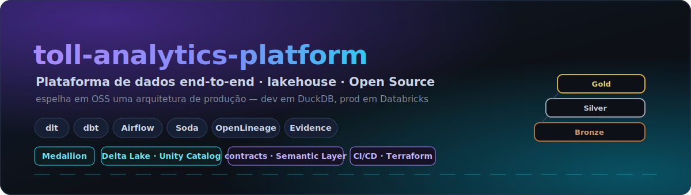
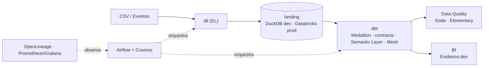
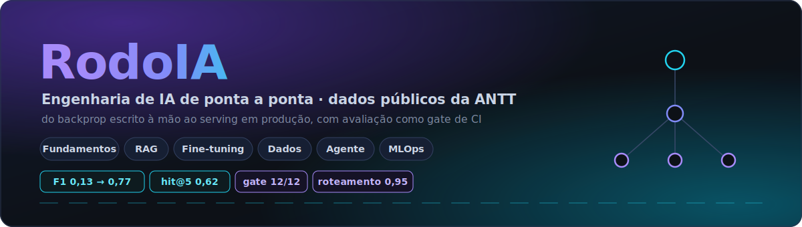
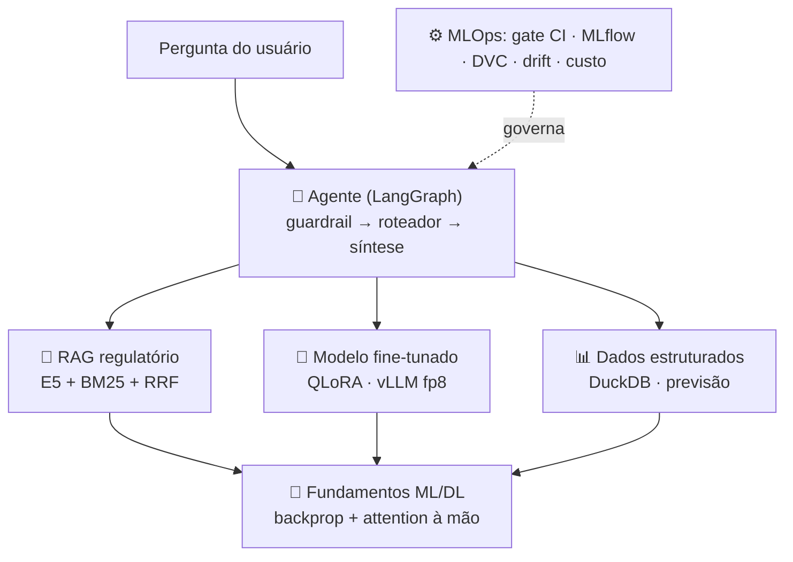
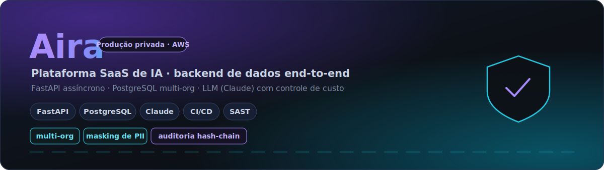
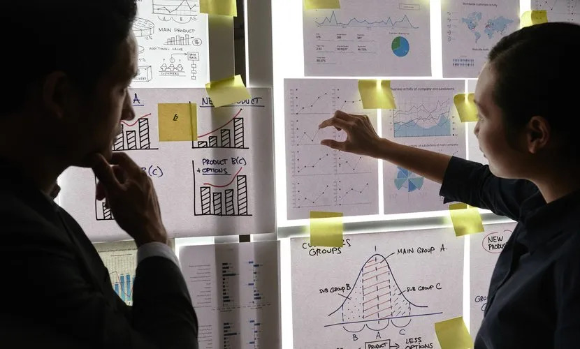
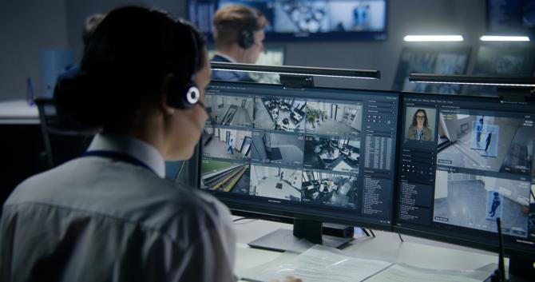

# Alan Joffre

### Data Engineer · Analytics Engineer · AI Engineer

**Lakehouse · dbt · Databricks · Delta Lake · Airflow · PySpark · AWS/Azure** &nbsp;•&nbsp; **RAG · LLM · fine-tuning (QLoRA) · vLLM · LangGraph · MLOps** &nbsp;•&nbsp; **SQL · Python**

[**🏗️ Engenharia de Dados**](#engenharia-de-dados) · [**🤖 IA / LLM**](#ia--llm-engineering) · [**📊 ML & Ciência de Dados**](#machine-learning--ciência-de-dados)

---

### Sobre mim

Engenheiro de Dados / Analytics Engineer com foco em **produtos de dados end-to-end** — da arquitetura **lakehouse** (Medallion, Databricks, Delta Lake) à entrega de análises prontas para decisão, com orquestração (Airflow), Data Quality, lineage e governança ponta a ponta.

Nos últimos projetos, expandi para **Engenharia de IA de produção**: RAG avaliado com rigor estatístico, fine-tuning de LLM próprio (QLoRA + serving em vLLM), agentes (LangGraph) e **MLOps com avaliação como gate de CI**. O projeto **[RodoIA](https://github.com/alanjoffre/rodoia)** abaixo prova esse ciclo completo — do *backpropagation* à mão ao deploy — sobre dados públicos reais.

---

## Engenharia de Dados

### [🏗️ toll-analytics-platform — Plataforma de dados end-to-end (Open Source)](https://github.com/alanjoffre/toll-analytics-platform)

Plataforma de dados **open-source ponta a ponta** que espelha em OSS a arquitetura aplicada em produção:

```mermaid
flowchart LR
  SRC["CSV / Eventos"] --> ING["dlt (EL)"]
  ING --> LAND[("landing<br/>DuckDB dev · Databricks prod")]
  LAND --> T["dbt<br/>Medallion · contracts · Semantic Layer · Mesh"]
  T --> DQ["Data Quality<br/>Soda · Elementary"]
  T --> BI["BI<br/>Evidence.dev"]
  ORCH["Airflow + Cosmos"] -.->|orquestra| ING
  ORCH -.->|orquestra| T
  OBS["OpenLineage · Prometheus/Grafana"] -.->|observa| ORCH
```

`dlt` (EL) → `dbt` (Medallion, model contracts, Semantic Layer, dbt Mesh) → `Airflow` + Astronomer Cosmos → Data Quality (`Soda`) → observabilidade/lineage (`OpenLineage`) → BI (`Evidence.dev`) → CI/CD + IaC (`Terraform`). Dev 100% em DuckDB; prod em Databricks (Unity Catalog + Delta).

➡️ **[Ver repositório](https://github.com/alanjoffre/toll-analytics-platform)** &nbsp;·&nbsp; **[▶ Dashboard ao vivo](https://alanjoffre.github.io/toll-analytics-platform/)**

---

## IA / LLM Engineering

### [🤖 RodoIA — Engenharia de IA de ponta a ponta sobre dados públicos da ANTT (Open Source)](https://github.com/alanjoffre/rodoia)

Portfólio de **AI Engineering** que prova o ciclo completo — do fundamento matemático ao serving em produção — sobre a regulação e os dados abertos do transporte rodoviário brasileiro. A maioria dos projetos de IA para em "chamei a API da OpenAI"; este vai do **backprop escrito à mão** ao **CI com avaliação como gate**.

```mermaid
flowchart TB
  Q["Pergunta do usuário"] --> AG["🤖 Agente (LangGraph)<br/>guardrail → roteador → síntese"]
  AG --> RAG["🔎 RAG regulatório<br/>E5 + BM25 + RRF"]
  AG --> FT["🎯 Modelo fine-tunado<br/>QLoRA · vLLM fp8"]
  AG --> DADOS["📊 Dados estruturados<br/>DuckDB · previsão"]
  RAG & FT & DADOS --> BASE["🧮 Fundamentos ML/DL<br/>backprop + attention à mão"]
  MLOPS["⚙️ MLOps: gate CI · MLflow · DVC · drift · custo"] -.->|governa| AG
```

**Resultados de relance** (todos com evidência versionada e IC):

| Eixo | Resultado |
|---|---|
| 🔎 **RAG** | hit@5 **0,62** · precisão de citação **0,92** · **auditoria κ humana** achou 16% dos rótulos-gold errados e reportou o impacto |
| 🎯 **Fine-tuning** | NER jurídico QLoRA: **F1 0,13 → 0,77** (SOTA 0,89) · serving vLLM fp8 **205 tok/s** |
| 📊 **Dados** | 741k linhas, esquema estrela DuckDB · **Holt-Winters bate o naïve** (pareado, IC) |
| 🤖 **Agente** | grafo LangGraph com arestas condicionais · **roteamento 0,95** (n=21) |
| ⚙️ **MLOps** | **gate 12/12** no CI · drift PSI 0,005 · custo R$/1k da vazão medida |

> **O diferencial não são os números altos — é o rigor ter corrigido os próprios números** (held-out derrubando memorização, backtest derrubando a "cereja", auditoria humana achando gold errado). Engenharia de IA a sério: deixar a evidência mandar.

➡️ **[Ver repositório](https://github.com/alanjoffre/rodoia)** &nbsp;·&nbsp; **[▶ Demo ao vivo (grátis)](https://huggingface.co/spaces/alanjoffre/rodoia-rag)** &nbsp;·&nbsp; **[📖 A história](https://github.com/alanjoffre/rodoia/blob/main/docs/HISTORIA.md)**

### 🧠 Aira — Plataforma SaaS de IA (em produção na AWS)

Engenharia de dados/backend de ponta a ponta: backend assíncrono **Python/FastAPI**, **PostgreSQL** multi-organização (migração em produção sem perda), integração **LLM (Anthropic Claude)** com controle de custo, **CI/CD** com testes contra Postgres e SAST, e segurança/governança (CSP, masking de PII, auditoria hash-chain).

---

## Machine Learning & Ciência de Dados

Base de ML aplicado (**25 projetos**) cobrindo classificação, regressão, séries temporais, NLP, visão computacional e streaming — código completo em **[github.com/alanjoffre/data-science](https://github.com/alanjoffre/data-science)**. Uma seleção:

<table>
<tr>
<td width="50%" valign="top">

**[🚚 Detecção de Anomalias em Tarifas](https://github.com/alanjoffre/data-science/tree/master/projetos/logistica_transporte/4_deteccao_de_anomalias_em_tarifas)**

Pipeline completo de detecção de anomalias em tarifas de viagens compartilhadas, combinando modelos supervisionados e não supervisionados.

</td>
<td width="50%" valign="top">

**[📈 Clusterização de Séries Temporais](https://github.com/alanjoffre/data-science/tree/master/projetos/logistica_transporte/3_analise_desempenho_viagens_agrupadas_clusterizacao_series_temporais)**

Segmentação com janelas sobrepostas + clusterização (K-Shape, DBSCAN), otimização via **Optuna** e rastreio no **MLflow**.

</td>
</tr>
<tr>
<td width="50%" valign="top">

**[💳 Detecção de Fraude em Cartão](https://github.com/alanjoffre/data-science/tree/master/projetos/creditcard_fraud_detection)**

Random Forest para fraude em transações financeiras, servido com **Flask · Spark · Kafka** (streaming).

</td>
<td width="50%" valign="top">

**[👁️ Reconhecimento Facial + Detecção de Objetos](https://github.com/alanjoffre/data-science/tree/master/projetos/reconhecimento_facial_e_deteccao_de_objetos)**

Visão computacional com monitoramento em tempo real, integrada a uma aplicação web.

</td>
</tr>
</table>

**[💬 Análise de Sentimentos (NLP)](https://github.com/alanjoffre/data-science/tree/master/projetos/analise-de-sentimentos)** — classificação de opiniões em larga escala com técnicas de NLP.

<b>📂 Ver a galeria completa (mais 20 projetos)</b>

 

**Logística & Transporte**
- [Análise de Compartilhamento de Viagem — Classificação](https://github.com/alanjoffre/data-science/tree/master/projetos/logistica_transporte/2_analise_compartilhamento_de_viagem_classificacao)
- [Previsão de Gorjeta — Regressão](https://github.com/alanjoffre/data-science/tree/master/projetos/logistica_transporte/1_previsao_gorjeta_regressao)
- [Otimização de Lucro no Transporte de Cargas — Algoritmos Genéticos](https://github.com/alanjoffre/data-science/tree/master/projetos/streamlit-12-aplicacoes-inteligencia-artificial/11.OtimizaCarga)

**Finanças & Risco**
- [Previsão de Câmbio Dólar/Real — Random Forest · XGBoost · LSTM](https://github.com/alanjoffre/data-science/tree/master/projetos/previsao_de_mercado_de_acoes)
- [Análise de Crédito — Modelos Preditivos](https://github.com/alanjoffre/data-science/tree/master/projetos/ciencia-de-dados-completo-real-2024)
- [Rotatividade de Clientes (Churn) — Classificação](https://github.com/alanjoffre/data-science/tree/master/projetos/rotatividade-de-clientes)
- [Dashboard de Monitoramento da Bolsa](https://github.com/alanjoffre/data-science/tree/master/projetos/streamlit-12-aplicacoes-inteligencia-artificial/13.Acoes)

**Visão Computacional & NLP**
- [OCR com Tesseract](https://github.com/alanjoffre/data-science/tree/master/projetos/reconhecimento_optico_de_caracteres_tesseract)
- [Geração de Imagens — IA Generativa](https://github.com/alanjoffre/data-science/tree/master/projetos/streamlit-12-aplicacoes-inteligencia-artificial/12.Generativa)

**Clustering, Recomendação & Séries Temporais**
- [Segmentação de Clientes — KMeans · Spark · Kafka](https://github.com/alanjoffre/data-science/tree/master/projetos/segmentacao_de_clientes_clustering)
- [Sistema de Recomendação — Regras de Associação](https://github.com/alanjoffre/data-science/tree/master/projetos/streamlit-12-aplicacoes-inteligencia-artificial/8.Recomendacao)
- [Previsão da Produção de Leite — Séries Temporais](https://github.com/alanjoffre/data-science/tree/master/projetos/streamlit-12-aplicacoes-inteligencia-artificial/5.Proleite)
- [Benchmark Visual de Previsão — Séries Temporais](https://github.com/alanjoffre/data-science/tree/master/projetos/streamlit-12-aplicacoes-inteligencia-artificial/9.BenchmarkST)

**Estatística, EDA & Aplicações**
- [Previsão de Custos de Franquia — Regressão Linear](https://github.com/alanjoffre/data-science/tree/master/projetos/streamlit-12-aplicacoes-inteligencia-artificial/3.Franquia)
- [Qualidade de Veículos — Classificação](https://github.com/alanjoffre/data-science/tree/master/projetos/streamlit-12-aplicacoes-inteligencia-artificial/4.QualidadeVeiculos)
- [Probabilidade de Falha de Equipamentos — Distribuição de Poisson](https://github.com/alanjoffre/data-science/tree/master/projetos/streamlit-12-aplicacoes-inteligencia-artificial/6.FalhaEquipamento)
- [Avaliação de Normalidade de Dados — EDA](https://github.com/alanjoffre/data-science/tree/master/projetos/streamlit-12-aplicacoes-inteligencia-artificial/7.Normalidades)
- [Análise de Dados Públicos de Despesas — EDA](https://github.com/alanjoffre/data-science/tree/master/projetos/streamlit-12-aplicacoes-inteligencia-artificial/10.Exploratoria)
- [App Completo Multi-página — Streamlit + IA](https://github.com/alanjoffre/data-science/tree/master/projetos/streamlit-12-aplicacoes-inteligencia-artificial/14.Appcompleta)
- [Análise de Estoque — Power BI](https://app.powerbi.com/view?r=eyJrIjoiZDg2NGExN2ItYzVjMS00NzY4LWE0Y2QtOGQ3Njc4NjUwOGUxIiwidCI6IjZmNjk1NmFkLWQxMDItNGRiZC04NTAyLTZjNmNmMDMxNjI5MSJ9)

---

&copy; 2026 Alan Joffre · Data Engineer · Analytics Engineer · AI Engineer · <a href="https://linkedin.com/in/alanjoffre">LinkedIn</a> · <a href="https://alanjoffre.github.io/my-profile/">Página pessoal</a>

