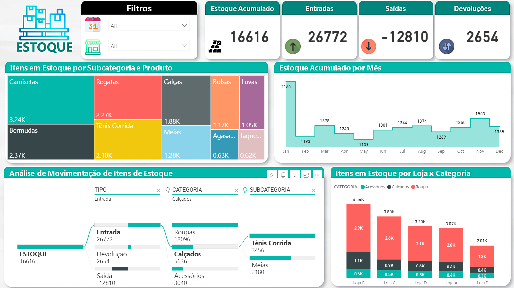
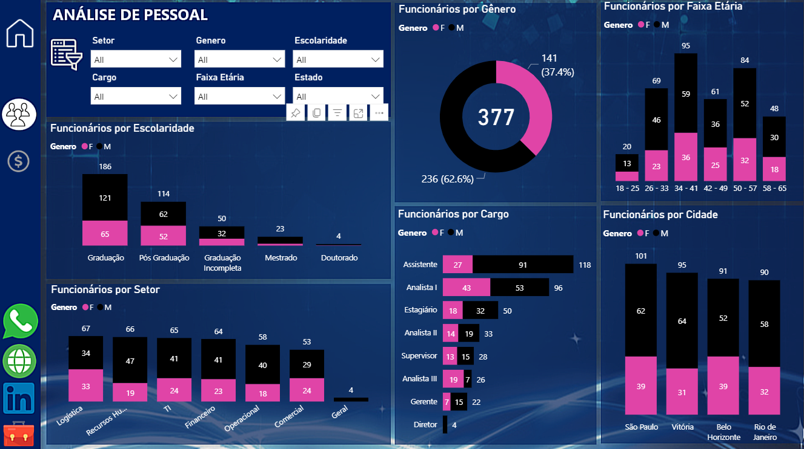
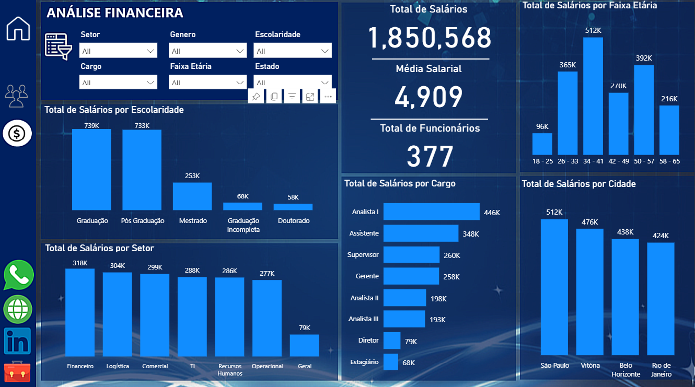

<h3><a id="inicio" href="https://alanjoffre.github.io/my-profile/"># Portfolio: Alan Joffre | Data Analyst | Data Engineer |</a></h3> 
 

<a id="inicio" href="https://github.com/alanjoffre/portfolio/tree/master/ciencia-de-dados/used-phones-&-tablets-pricing-dataset"># Project: Data Science | Used Phones & tablets Pricing Dataset</a> 

  

 

<a id="inicio" href="https://github.com/alanjoffre/portfolio/tree/master/ciencia-de-dados/wine-quality"># Project: Data Science | Wine Quality</a>

  

 

<a id="inicio" href="https://github.com/alanjoffre/portfolio/tree/master/ciencia-de-dados/exchange-rate-forecast"># Project: Data Science | Exchange Rate Forecast</a> 

  

 

<a id="inicio" href="https://app.powerbi.com/view?r=eyJrIjoiZDg2NGExN2ItYzVjMS00NzY4LWE0Y2QtOGQ3Njc4NjUwOGUxIiwidCI6IjZmNjk1NmFkLWQxMDItNGRiZC04NTAyLTZjNmNmMDMxNjI5MSJ9"># Project: Power BI - Inventory Analysis </a> 

  

 

<a id="inicio" href="https://app.powerbi.com/view?r=eyJrIjoiMTdjMjk0NGQtNmQ1ZS00ZjUyLTkzNzctNGExYzdjMjY2NzEyIiwidCI6IjZmNjk1NmFkLWQxMDItNGRiZC04NTAyLTZjNmNmMDMxNjI5MSJ9"># Project: Power BI - Employee Analytics </a> 

  
  
  

 
