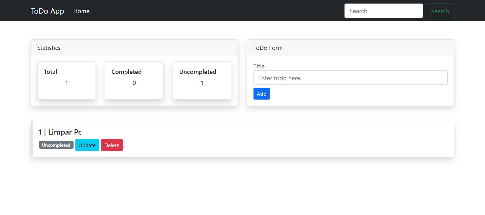
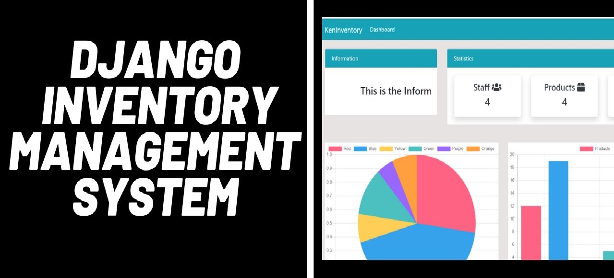

# Portfólio: Alan Joffre
Desenvolvedor Python - Cientista de Dados  
Com dois anos de experiência, focado em lidar com a complexidade dos negócios e entregar software de alta qualidade que seja escalável e resiliente.

<a id="inicio" href="https://github.com/alanjoffre/portfolio/tree/master/ciencia-de-dados/black-friday"># Projeto: Ciência de Dados - Black Friday</a> 

  

 

<a id="inicio" href="https://github.com/alanjoffre/portfolio/tree/master/ciencia-de-dados/google-play"># Projeto: Ciência de Dados - Play Store</a> 

  

 

<a id="inicio" href="https://github.com/alanjoffre/portfolio/tree/master/ciencia-de-dados/data-mining"># Projeto: Ciência de Dados - Data Mining</a> 

  

 

<a id="inicio" href="https://github.com/alanjoffre/portfolio/tree/master/ciencia-de-dados/wine-analysis"># Projeto: Ciência de Dados - Wine Analysis</a>

  

 

<a id="inicio" href="https://github.com/alanjoffre/portfolio/tree/master/python-flask/toDo"># Projeto: Python - Flask</a>
- Aplicação Web To Do List
- HTML | CSS | JavaScript | Bootstrap5 | Python | Flask | SQLAlchemy | SQLite | CRUD |

  

 

<a id="inicio" href="https://github.com/alanjoffre/portfolio/tree/master/python-django/inventory-management-system"># Projeto: Python - Django</a>
- Django Inventory Management System Web Application
- HTML | CSS | JavaScript | Bootstrap5 | Python | Django | SQLAlchemy | SQLite | CRUD |

  

 

