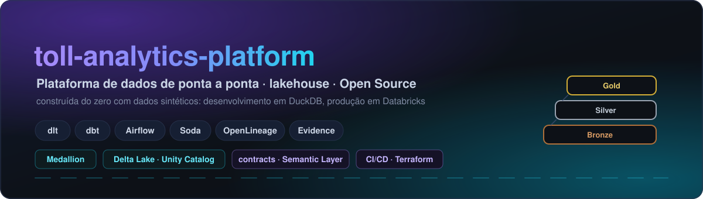
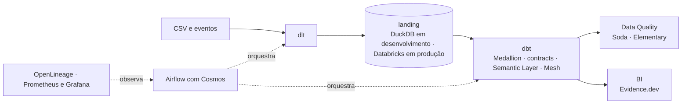
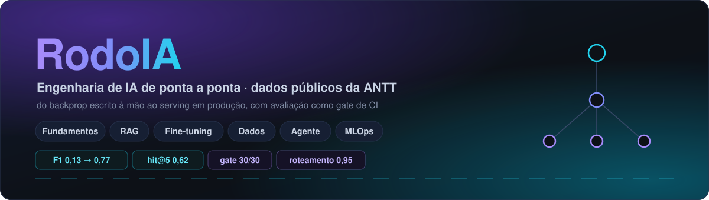
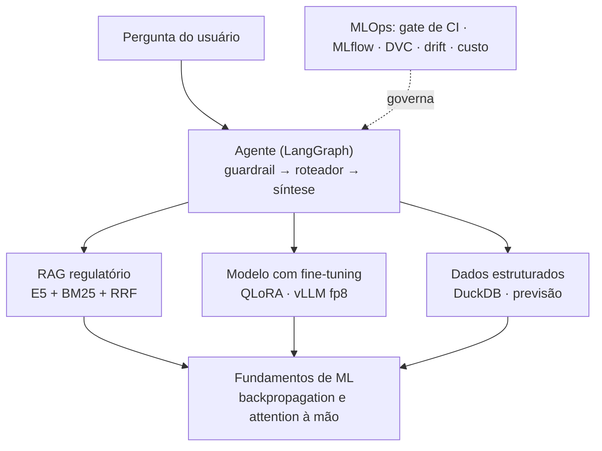
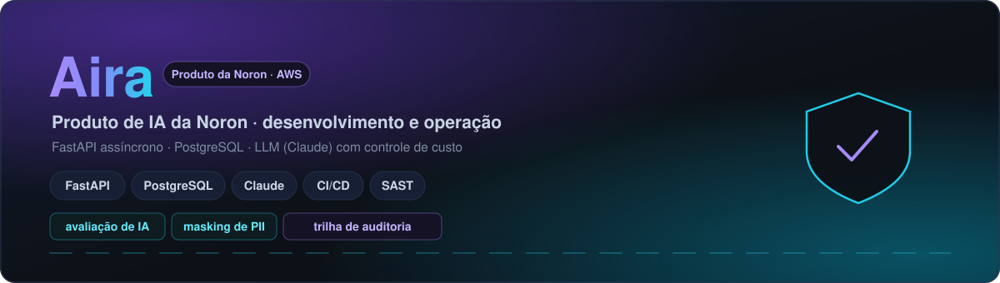

# Alan Joffre — portfólio

**Engenheiro de Dados** · [Noron.dev](https://noron.dev) · São Paulo, SP

[LinkedIn](https://www.linkedin.com/in/alanjoffre) · [GitHub](https://github.com/alanjoffre) · [Página pessoal](https://alanjoffre.github.io/my-profile/) · [Currículo (PDF)](https://alanjoffre.github.io/my-profile/assets/curriculo_alanjoffre_ptbr.pdf)

## Em 30 segundos

- **Dados:** lakehouse em Databricks e dbt em cliente real, com o tempo de apuração reduzido de até 20 para 2 dias; aqui, o mesmo desenho em open source, com testes e CI.
- **IA aplicada com avaliação:** RAG, fine-tuning e Text-to-SQL medidos com intervalo de confiança (IC) e avaliação como gate de CI.
- **Back-end:** Python/FastAPI em produção na Aira, produto de IA da Noron, e um banco digital fictício em Java com concorrência medida.

Cada projeto abaixo segue o mesmo molde: o problema, a decisão principal, o resultado medido, a stack e os links. Os números vêm de testes ou de medições versionadas no repositório. Os projetos abertos são feitos com apoio de assistente de IA (Claude), visível nos commits; o escopo, as decisões de arquitetura e as medições são meus, e revisei o resultado.

## Engenharia de dados

### oss-lakehouse — lakehouse sobre dados reais do GitHub

- **Problema:** aprender e mostrar engenharia de dados em Databricks sem depender de conta de nuvem, sobre dados reais.
- **Decisão:** o mesmo código roda localmente (PySpark e Delta Lake) e no Databricks (job em Databricks Asset Bundles). A infraestrutura Azure está em Terraform, verificada com `terraform validate`, sem `apply`.
- **Resultado:** 18 notebooks executados, com o resultado na própria célula, e um pacote Python com mais de 180 testes e CI. Cobre ingestão incremental, MERGE e SCD2, Structured Streaming, modelagem dimensional, qualidade e contratos, performance no Spark com data skew real, governança e LGPD, e IA dentro do pipeline avaliada contra gabarito.
- **Stack:** PySpark · Delta Lake · Databricks · Terraform · GitHub Actions
- **Links:** [repositório do oss-lakehouse](https://github.com/alanjoffre/oss-lakehouse) · [guia de estudo com 199 perguntas respondidas](https://github.com/alanjoffre/oss-lakehouse/blob/main/GUIA_DE_ESTUDO.md)

### toll-analytics-platform — plataforma de dados de ponta a ponta

- **Problema:** construir do zero, com ferramentas abertas e dados sintéticos, uma plataforma de dados completa. O repositório não contém código, dado nem regra de empregador ou cliente.
- **Decisão:** desenvolvimento em DuckDB e produção em Databricks, sem alterar o SQL.
- **Resultado:** modelagem Medallion com contracts, unit tests, Semantic Layer e dbt Mesh; CI/CD com 10 workflows (Slim CI, gate de Data Quality, promoção de staging para produção); [dashboard ao vivo](https://alanjoffre.github.io/toll-analytics-platform/).
- **Stack:** dlt · dbt · Airflow com Cosmos · Soda · OpenLineage · Evidence.dev · Kafka (Redpanda) · Terraform
- **Links:** [repositório do toll-analytics-platform](https://github.com/alanjoffre/toll-analytics-platform) · [dashboard ao vivo](https://alanjoffre.github.io/toll-analytics-platform/)

```mermaid
flowchart LR
  SRC["CSV e eventos"] --> ING["dlt"]
  ING --> LAND[("landing<br/>DuckDB em desenvolvimento · Databricks em produção")]
  LAND --> T["dbt<br/>Medallion · contracts · Semantic Layer · Mesh"]
  T --> DQ["Data Quality<br/>Soda · Elementary"]
  T --> BI["BI<br/>Evidence.dev"]
  ORCH["Airflow com Cosmos"] -.->|orquestra| ING
  ORCH -.->|orquestra| T
  OBS["OpenLineage · Prometheus e Grafana"] -.->|observa| ORCH
```

## Engenharia de IA

### RodoIA — engenharia de IA de ponta a ponta

- **Problema:** ir além de "chamar a API de um modelo": do backpropagation escrito à mão ao serving em produção, sobre a regulação e os dados abertos da ANTT.
- **Decisão:** motor de dados escolhido por benchmark (DuckDB 6,7 vezes mais rápido que o Spark, sem divergências) e avaliação como gate de CI, que barra a entrega quando a qualidade cai.
- **Resultado:** RAG com hit@5 de 0,62 e precisão de citação de 0,92; fine-tuning QLoRA em NER jurídico (reconhecimento de entidades) com F1 de 0,13 para 0,77, servido com vLLM a 205 tokens/s; agente em LangGraph com roteamento de 0,95 (n=21); gate 30/30 e 302 testes.
- **Stack:** PyTorch · Hugging Face · Qdrant · LangGraph · vLLM · DuckDB · MLflow · DVC
- **Links:** [repositório do RodoIA](https://github.com/alanjoffre/rodoia) · [demo ao vivo](https://huggingface.co/spaces/alanjoffre/rodoia-rag) · [a história do projeto](https://github.com/alanjoffre/rodoia/blob/main/docs/HISTORIA.md)

O diferencial não são os números altos, e sim o rigor de corrigir os próprios números: o conjunto held-out desfez a memorização, o backtest desfez uma escolha a dedo e a auditoria humana encontrou 16% dos rótulos de referência errados.

```mermaid
flowchart TB
  Q["Pergunta do usuário"] --> AG["Agente (LangGraph)<br/>guardrail → roteador → síntese"]
  AG --> RAG["RAG regulatório<br/>E5 + BM25 + RRF"]
  AG --> FT["Modelo com fine-tuning<br/>QLoRA · vLLM fp8"]
  AG --> DADOS["Dados estruturados<br/>DuckDB · previsão"]
  RAG & FT & DADOS --> BASE["Fundamentos de ML<br/>backpropagation e attention à mão"]
  MLOPS["MLOps: gate de CI · MLflow · DVC · drift · custo"] -.->|governa| AG
```

### RodoQuery — Text-to-SQL sobre camada semântica

- **Decisão:** o agente consulta a camada semântica (Semantic Layer) em vez de escrever SQL cru, com avaliação por execução e guardrails.
- **Resultado:** 100% (IC 97,4 a 100) contra 44,5% do SQL direto, n=146, em dados reais da ANTT; 251 testes.
- **Links:** [repositório do RodoQuery](https://github.com/alanjoffre/rodoquery)

### NãoConsta — RAG contratual avaliado pelo que recusa

- **Decisão:** medir o agente pela capacidade de responder "não consta no contrato" quando a resposta não existe.
- **Resultado:** benchmark CUAD com 510 contratos e 20.910 perguntas, 68% delas sem resposta no contrato.
- **Links:** [repositório do NãoConsta](https://github.com/alanjoffre/naoconsta)

## Back-end em Java

### Ledgerly Bank — banco digital fictício em Java

- **Problema:** mostrar back-end de sistema financeiro com consistência de saldo sob concorrência, construído do zero e em público.
- **Decisão:** razão contábil em partidas dobradas e Pix com Saga, Outbox e Kafka; extrato em CQRS (MongoDB).
- **Resultado:** saldo sem gasto duplo sob 1.500 saques simultâneos; 1.141 testes, 96,7% de mutação no domínio, 92,6% de cobertura e contratos com Pact; 47 ADRs (registros de decisão de arquitetura).
- **Stack:** Java 25 · Spring Boot · Quarkus · Kafka · MongoDB · Keycloak · ONNX · React
- **Links:** [repositório do Ledgerly Bank](https://github.com/alanjoffre/ledgerly-bank)

## Em produção: Aira

Sou o responsável técnico pelo desenvolvimento e pela operação da Aira, produto de IA da Noron, em produção na AWS. Back-end assíncrono em Python/FastAPI e PostgreSQL, com migração de banco em produção conferida por contagem de linhas e LLM (Claude) com controle de custo. Segurança e governança com mascaramento de dados pessoais, trilha de auditoria e análise estática de segurança (Bandit/Ruff) no gate de release. Código fechado.

## Trabalhos anteriores: machine learning

<b>Ver uma seleção de 6 projetos de ML aplicado</b>

 

- [Detecção de anomalias em tarifas](https://github.com/alanjoffre/data-science/tree/master/projetos/logistica_transporte/4_deteccao_de_anomalias_em_tarifas) — modelos supervisionados e não supervisionados em tarifas de viagens compartilhadas.
- [Clusterização de séries temporais](https://github.com/alanjoffre/data-science/tree/master/projetos/logistica_transporte/3_analise_desempenho_viagens_agrupadas_clusterizacao_series_temporais) — janelas sobrepostas e clusterização (K-Shape, DBSCAN), com Optuna e MLflow.
- [Detecção de fraude em cartão](https://github.com/alanjoffre/data-science/tree/master/projetos/creditcard_fraud_detection) — Random Forest para detectar fraude, servido em streaming com Flask, Spark e Kafka.
- [Reconhecimento facial e detecção de objetos](https://github.com/alanjoffre/data-science/tree/master/projetos/reconhecimento_facial_e_deteccao_de_objetos) — visão computacional em tempo real, integrada a uma aplicação web.
- [Análise de sentimentos](https://github.com/alanjoffre/data-science/tree/master/projetos/analise-de-sentimentos) — classificação de opiniões em larga escala com NLP.
- [Previsão de câmbio dólar/real](https://github.com/alanjoffre/data-science/tree/master/projetos/previsao_de_mercado_de_acoes) — Random Forest, XGBoost e LSTM.

Os 25 projetos estão no repositório [data-science](https://github.com/alanjoffre/data-science).

