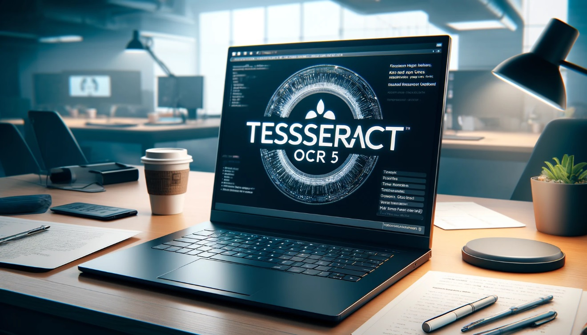

# Portfólio: Alan Joffre

## Ciência de Dados | Engenharia de Dados | Analista de Dados |

### Sobre Mim
Sou um cientista de dados e engenheiro de dados apaixonado por resolver problemas complexos e transformar dados em insights acionáveis. Tenho experiência em diversas ferramentas e tecnologias de ciência de dados e gosto de explorar novas abordagens para obter os melhores resultados.

### Projetos

#### [Logistica | Transporte: Desempenho de Viagens Agrupadas - Clusterização de Séries Temporais.](https://github.com/alanjoffre/data-science/tree/master/projetos/logistica_transporte/3_analise_desempenho_viagens_agrupadas_clusterizacao_series_temporais)

  

- **Este projeto implementa um pipeline completo para análise de desempenho de viagens agrupadas, utilizando técnicas avançadas de pré-processamento, engenharia de features, segmentação com janelas sobrepostas, normalização e clusterização de séries temporais. O pipeline também inclui a otimização dos hiperparâmetros via Optuna e a comparação com modelos alternativos (K-Shape e DBSCAN), registrando todos os resultados e parâmetros no MLflow.

#### [Logistica | Transporte: Analise de Compartilhamento de Viagem - Utilizando Classificação.](https://github.com/alanjoffre/data-science/tree/master/projetos/logistica_transporte/2_analise_compartilhamento_de_viagem_classificacao)

  

- **Projeto de análise de compartilhamento de viagens com classificação, utilizando machine learning, pipelines otimizados e arquitetura escalável para identificar padrões e prever comportamentos dos usuários.

#### [Logistica | Transporte: Previsão de gorjeta - Utilizando Regressão.](https://github.com/alanjoffre/data-science/tree/master/projetos/logistica_transporte/1_previsao_gorjeta_regressao)

  

- **Projeto de análise de gorjetas com regressão e machine learning, com pipelines otimizados e arquitetura escalável para prever comportamento do cliente e oferecer insights em tempo real, identificando tendência.

#### [Reconhecimento Facial e Detecção de Objetos.](https://github.com/alanjoffre/data-science/tree/master/projetos/reconhecimento_facial_e_deteccao_de_objetos)

  

- **Este projeto é uma solução avançada que integra reconhecimento facial, detecção de objetos e funcionalidades de monitoramento em tempo real. Ele utiliza tecnologias de aprendizado de máquina, visão computacional e desenvolvimento web para criar um sistema robusto e escalável.

#### [Reconhecimento Óptico de Caracteres (OCR) com Tesseract.](https://github.com/alanjoffre/data-science/tree/master/projetos/reconhecimento_optico_de_caracteres_tesseract)

  

- **Este projeto visa realizar o reconhecimento óptico de caracteres (OCR) em imagens usando a ferramenta Tesseract. O OCR é realizado em imagens de texto e os resultados são extraídos e salvos em arquivos de texto e banco de dados.

#### [Logística e Transporte - 13 projetos | Machine Learning | Redes Neurais.](https://github.com/alanjoffre/data-science/tree/master/projetos/logistica_transporte)

  

- **Este projeto tem como objetivo analisar dados de viagens de uma empresa de transporte e logística para otimizar operações e melhorar a eficiência. Utilizando técnicas de Machine Learning e análises de dados, buscamos insights valiosos para diversas áreas, como previsão de gorjeta, comportamento de compartilhamento de viagem, desempenho de viagens agrupadas, detecção de anomalias em tarifas, análise geoespacial, modelagem de receita, eficácia das cobranças adicionais, otimização de rotas, gerenciamento de frota, análise de demanda, eficiência operacional, planejamento urbano e análise de custos. 

#### [Prev. do mercado de câmbio entre o dólar e o real: Yfinance | Random Forest](https://github.com/alanjoffre/data-science/tree/master/projetos/previsao_de_mercado_de_acoes)

  

- **Este projeto tem como objetivo a previsão do mercado de câmbio entre o dólar e o real utilizando diferentes técnicas de machine learning, como Regressão Linear, Random Forest, XGBoost, Redes Neurais e LSTM. A previsão é realizada utilizando dados históricos coletados através do Yahoo Finance, com diversas etapas de processamento, treinamento de modelos e avaliação de desempenho. 

#### [Detectação de Fraude em Cartão de Credito - Random Forest | Flask | Spark | Kafka](https://github.com/alanjoffre/data-science/tree/master/projetos/creditcard_fraud_detection)

  

- **Descrição**: Projeto de detecção de fraudes em transações de cartões de crédito utilizando o algoritmo Random Forest. O objetivo é identificar e prever diferentes tipos de atividades fraudulentas em operações financeiras, melhorando a segurança e a confiabilidade do sistema de pagamentos.

#### [Segmentação de Clientes - KMeans | Spark | Kafka](https://github.com/alanjoffre/data-science/tree/master/projetos/segmentacao_de_clientes_clustering)

  

- **Descrição**: Projeto de segmentação de clientes utilizando o algoritmo de clustering KMeans para identificar diferentes segmentos de clientes e melhorar as estratégias de marketing.

#### [Análise de Sentimentos](https://github.com/alanjoffre/data-science/tree/master/projetos/analise-de-sentimentos)

  

- **Descrição**: Projeto de análise de sentimentos em um grande conjunto de dados utilizando técnicas de NLP e aprendizado de máquina para classificar opiniões de usuários.

#### [Rotatividade de Clientes](https://github.com/alanjoffre/data-science/tree/master/projetos/rotatividade-de-clientes)

  

- **Descrição**: Projeto para prever a rotatividade de clientes utilizando algoritmos de classificação para identificar padrões de comportamento.

#### [Análise de Crédito](https://github.com/alanjoffre/data-science/tree/master/projetos/ciencia-de-dados-completo-real-2024)

  

- **Descrição**: Projeto de análise de crédito utilizando modelos preditivos para avaliar o risco de inadimplência.

#### [Prevendo Custos para Abrir Franquia - Regressão Linear](https://github.com/alanjoffre/data-science/tree/master/projetos/streamlit-12-aplicacoes-inteligencia-artificial/3.Franquia)

  

- **Descrição**: Projeto de previsão de custos para abertura de franquias utilizando regressão linear para auxiliar no planejamento financeiro.

#### [Prevendo a Qualidade de Veículos - Classificação](https://github.com/alanjoffre/data-science/tree/master/projetos/streamlit-12-aplicacoes-inteligencia-artificial/4.QualidadeVeiculos)

  

- **Descrição**: Projeto de classificação da qualidade de veículos utilizando algoritmos de classificação para identificar veículos de alta e baixa qualidade.

#### [Prevendo a Produção de Leite - Séries Temporais / Previsão / Decomposição](https://github.com/alanjoffre/data-science/tree/master/projetos/streamlit-12-aplicacoes-inteligencia-artificial/5.Proleite)

  

- **Descrição**: Projeto de previsão da produção de leite utilizando técnicas de séries temporais para ajudar na gestão de produção agrícola.

#### [Avaliando a Probabilidade de Quebra de Equipamentos - Distribuição Poisson](https://github.com/alanjoffre/data-science/tree/master/projetos/streamlit-12-aplicacoes-inteligencia-artificial/6.FalhaEquipamento)

  

- **Descrição**: Projeto de avaliação da probabilidade de falha de equipamentos utilizando a distribuição de Poisson para melhorar a manutenção preventiva.

#### [Avaliando a Normalidade de Dados - Distribuição Normal - Visualização - EDA](https://github.com/alanjoffre/data-science/tree/master/projetos/streamlit-12-aplicacoes-inteligencia-artificial/7.Normalidades)

  

- **Descrição**: Projeto de avaliação da normalidade de dados utilizando visualizações e análise exploratória de dados (EDA) para entender a distribuição dos dados.

#### [Criando um Sistema de Recomendação - Machine Learning - Regras de Associação](https://github.com/alanjoffre/data-science/tree/master/projetos/streamlit-12-aplicacoes-inteligencia-artificial/8.Recomendacao)

  

- **Descrição**: Projeto de criação de um sistema de recomendação utilizando machine learning e regras de associação para personalizar as sugestões de produtos para os usuários.

#### [Fazendo um Benchmark Visual de Previsão de Produção - Séries Temporais](https://github.com/alanjoffre/data-science/tree/master/projetos/streamlit-12-aplicacoes-inteligencia-artificial/9.BenchmarkST)

  

- **Descrição**: Projeto de benchmark visual para previsão de produção utilizando séries temporais para comparar diferentes modelos de previsão.

#### [Analisando Dados Públicos de Despesas - Análise Exploratória de Dados](https://github.com/alanjoffre/data-science/tree/master/projetos/streamlit-12-aplicacoes-inteligencia-artificial/10.Exploratoria)

  

- **Descrição**: Projeto de análise exploratória de dados (EDA) em dados públicos de despesas para identificar padrões e insights.

#### [Otimização de Lucro no Transporte de Cargas - Algoritmos Genéticos](https://github.com/alanjoffre/data-science/tree/master/projetos/streamlit-12-aplicacoes-inteligencia-artificial/11.OtimizaCarga)

  

- **Descrição**: Projeto de otimização de lucro no transporte de cargas utilizando algoritmos genéticos para melhorar a eficiência logística.

#### [Geração de Imagens para Empresa de Marketing - IA Generativa](https://github.com/alanjoffre/data-science/tree/master/projetos/streamlit-12-aplicacoes-inteligencia-artificial/12.Generativa)

  

- **Descrição**: Projeto de geração de imagens utilizando IA generativa para criação de conteúdos visuais para empresas de marketing.

#### [Dashboard para Monitoramento da Bolsa de Valores - Visualização de Dados](https://github.com/alanjoffre/data-science/tree/master/projetos/streamlit-12-aplicacoes-inteligencia-artificial/13.Acoes)

  

- **Descrição**: Projeto de criação de dashboard para monitoramento da bolsa de valores utilizando visualização de dados para acompanhar as tendências do mercado financeiro.

#### [App Completo com Múltiplas Páginas e Publicação na Internet - Streamlit + IA](https://github.com/alanjoffre/data-science/tree/master/projetos/streamlit-12-aplicacoes-inteligencia-artificial/14.Appcompleta)

  

- **Descrição**: Projeto de desenvolvimento de um aplicativo completo com múltiplas páginas utilizando Streamlit e inteligência artificial para diversas funcionalidades.

#### [Análise de Estoque com Power BI](https://app.powerbi.com/view?r=eyJrIjoiZDg2NGExN2ItYzVjMS00NzY4LWE0Y2QtOGQ3Njc4NjUwOGUxIiwidCI6IjZmNjk1NmFkLWQxMDItNGRiZC04NTAyLTZjNmNmMDMxNjI5MSJ9)

  

- **Descrição**: Projeto de análise de estoque utilizando Power BI para criação de dashboards interativos e visualização de dados de inventário.

---

&copy; 2024 Alan Joffre. Todos os direitos reservados.

